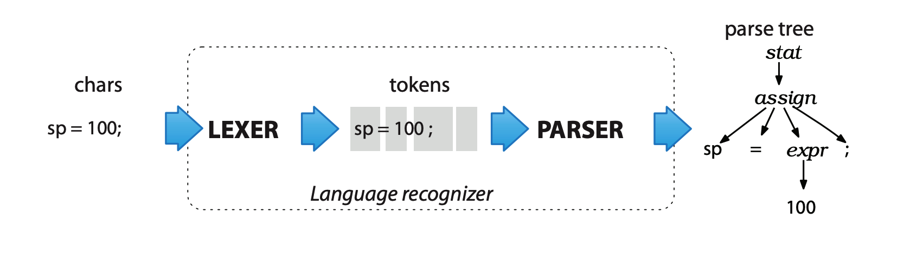
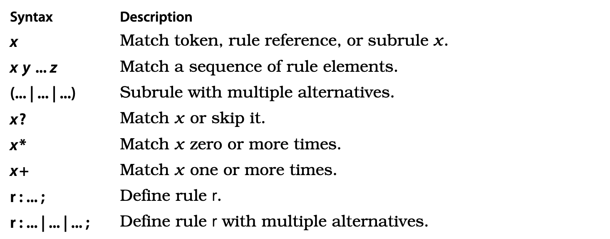
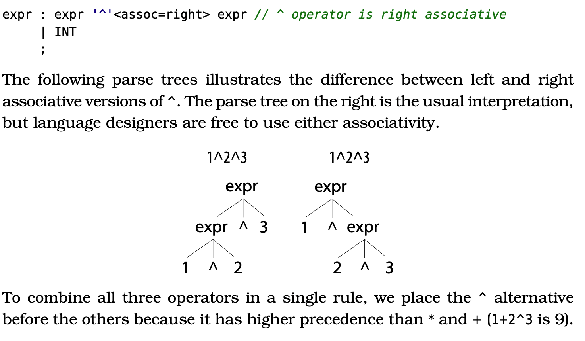
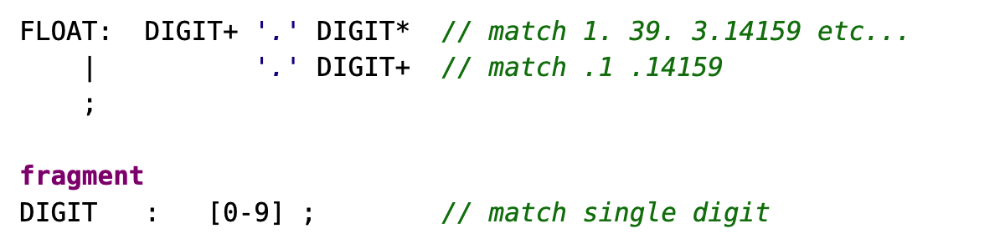

# 编译器前端实现研究

实现一种语言的编译器前端有多种方法，主要包括两个部分：

- 词法解析器
- 语法解析器

其中词法解析过程可以使用手动编程构建有限状态机的方式来实现，而语法解析器则需要手动实现上下文无关文法的分析。如果语言比较复杂的话，手动实现工作量巨大，也不易于修改和完善，这是手动实现的一些弊端，当然手动实现是一种非常棒的学习方法，这一点是不可否认的。

如果有能力手动实现那自然是很好的，在这其中也有一个陷阱，那就是不要做没有理论指导的手动实现。例如实现词法解析器的过程，你当然可以自己创造一种蹩脚的方式来实现词法解析，但是如果读过词法解析的相关理论，就自然知道有更好的实现方法，那么在初期学习的阶段就没有必要自己绞尽脑汁去做一种坐井观天的实现，而是要先学习现有的理论知识，后续知道更多了，再来改进现有的工作才是更好的做法。

说实话手动实现一个编译器前端对我来说确实是个比较困难的工作，但是我感觉这项技能似乎用到的地方很多，比如说：

- 理解不同语言之间的异同点
- 根据 BNF 理解某段代码是否符合语言规范
- 理解自动生成程序流程图的过程
- 更快地学会一门新的语言

理解编译原理好处多多，因此我不想放弃，决定花费更多时间在这项技能上，我决定先学习 ANTLR，后续利用该工具能解决一些工作上所需要处理的形式文本的问题，在实践中不断理解编译原理。话不多说，接下来就认真学习 ANTLR 工具吧。 

## ANTLR 安装配置方法

具体的安装方法可以在每次安装的时候到 ANTLR 的官方仓库去找，就没必要写的很仔细了，linux 机器上的安装时比较方便的，所以这里就只列出 windows 下安装以及配置方法了。

### Windows

安装 java 开发环境，修改 antlr_jar 文件夹下的 bat 文件，将 jar 文件的指定路径修改正确，
然后将 bat 文件所在目录加入系统环境变量，即可使用 antlr 与 grun 命令开发与验证语法分析应用。

## ANTLR 使用方法初探

### 利用 ANTLR 进行词法解析

用于测试的语法规则如下：

```c
grammar Hello;            // Define a grammar called Hello
r  : 'hello' ID ;         // match keyword hello followed by an identifier
ID : [a-z]+ ;             // match lower-case identifiers
WS : [ \t\r\n]+ -> skip ; // skip spaces, tabs, newlines, \r (Windows)
```

1. 使用 ANTLR 编译语法规则

```
antlr Hello.g4
```
2. 使用 Java 编译 ANTLR 生成的文件，生成语法分析器

```
javac *.java
```

- 调用生成的分析器，打印出对 hello.txt 的语法分析结果

```shell
grun Hello tokens -tokens hello.txt
```

### ANTLR 语法解析示例

在语法解析前需要先进行词法解析，将输入的文本提取为一个个 token，然后再进行语法分析，生成抽象语法树即 AST。所以语法解析一般都会引用先前编写的词法解析规则，然后在此基础上扩展语法规则。

一般情况下，如果词法解析文件比较复杂，那么会将词法解析规则单独放置在一个文件中，然后在语法解析规则文件中引用词法解析规则文件。当然如果词法解析非常简单，那么自然可以将词法解析与语法解析放置在一个文件中。

1. 生成解析器与词法分析器

```
antlr Hello.g4
```

2. 编译规则文件，生成语法分析器

```
javac *.java
```

3. 利用 `grun` 验证规则文件

```shell
grun Hello r -tokens
```

```
grun Hello r -tree
```

```shell
grun Hello r -tree -gui # 图形化的方式展示语法树
```

运行上述命令后会要求输入将要被解析的文本，输入相应文本后使用在 unix 下使用 `ctrl + d` 或者在 windows 下按下 `Ctrl+Z` 结束输入。

### Options briefly

| Options                | 作用                                                         |
| ---------------------- | ------------------------------------------------------------ |
| -tokens                | 打印出字元流（tokens）                                       |
| -tree                  | 使用 LISP 形式打印出解析树                                   |
| -gui                   | 使用对话框的形式可视化展示解析树                             |
| -ps file.ps            | generates a visual representation of the parse tree in PostScript and stores it in file.ps. The parse tree figures in this chapter were generated with -ps. |
| -encoding encodingname | specifies the test rig input file encoding if the current locale would not read the input properly. |
| -trace                 | 按照规则进入和退出的时候打印规则名称以及当前 token           |
| -diagnostics           | 在解析过程中打开诊断信息。这个选项产生的信息只是为了一些非一般的情况，例如模棱两可的输入短语 |
| -SLL                   | 使用一种更快速但是更弱的解析策略                             |

## 整体概念

通过操作解析树，多个需要识别相同语言的应用可以复用同一个解析器。另一种选择是将应用特有的代码片段直接嵌入到语法中，这是解析器传统的方式，但是如果使用解析树的话，可以做到更内聚和解耦的设计。也就是说后续的应用直接再次使用解析树就可以了，这样做到了更好的分层设计。

解析树对于要多次遍历的应用很有用，同时编码和测试也都更方便，不会过于复杂。比起每次都重新解析一次输入的字符，仅仅多次遍历解析树也是更有效率的一种方式。

### 解析过程如何实现



以一个简单的赋值语句为例：

```c
// assign : ID '=' expr ';' ;
void assign() { // method generated from rule assign
match(ID);      // compare ID to current input symbol then consume
match('=');
expr();         // match an expression by calling expr()
match(';');
}
```

### 模棱两可的语句

在自然语言中模棱两可的语句可能会比较好玩，但是会对基于计算机的语言应用造成问题。为了解释或者翻译一个短语，一个程序必须独一无二地理解它的含义。这也就是说我们必须提供没有二义性的语法，这样产生的解析器才可以用精确地方式匹配输入的短语。

在后续生成解析器的过程中，要逐渐学会处理各种二义性问题。在一些情况下，如果输入的词组符合多重选择，ANTLR 会选择可选项的第一个作为当前匹配项。

### Parse-Tree Listeners and Visitors

ANTLR  provides  support  for  two  tree-walking  mechanisms  in  its  runtimelibrary.  

这两种机制用来连接应用专用的代码和解析器

####Parse-Tree Listeners

####  Parse-Tree Visitors

#### Parsing Terms

- Parser

  一个解析器通过根据语法的规则检查句子的结构来检查句子是否属于特定的语言。对于解析过程最好的类比是穿过一个迷宫，将句子中的词组和写在一路地板上的词组作对比，来从入口走到出口。

- Recursive-descent parser

  这是一种特定类型的自顶向下的解析器，为语法中的每一个规则都实现了一个函数。

- Lookahead

  解析器通过比较每一个可选择路径起始的符号，使用 lookahead 来做决定。

### 使用 ANTLR 创建语言应用

当我们编写好语法描述文件后，可以使用 ANTLR 来产生一系列文件，这些文件先前都需要手动编写。

- ArrayInitParser

### 将语法规则放入不同文件

我们可以将语法规则描述分为解析解析器规则和词法器规则。因为不同的编程语言在从词法的角度来说他们有相当程度的重叠。例如，标识符和数字在多种语言中一般是相同的。将词法规则提出到一个模块中意味着我们可以将他使用到不同的解析语法中。

监听者和访问者很棒因为他们使得应用专用的代码和语法分开，使得语法更易读，而且避免与特定的应用纠缠在一起。

### Island Grammars

Dealing with Different Formats in the Same File.

ANTLR provides a well-known lexer feature called lexical modes that lets usdeal easily with files containing mixed formats. The basic idea is to have thelexer  switch  back  and  forth  between  modes  when  it  sees  special  sentinel character sequences.

```sh
grun XML tokens -tokens t.xml
```

In this case, we use the grammar name fol-lowed by special rule name tokens to tell the test rig it should run the lexerbut not the parser. Then, we use test rig option -tokens to print out the list ofmatched tokens.

Knowledge of the token stream flowing from the lexer to the parser can bepretty useful. For example, some translation problems are really just tweaksof  the  input.  We  can  sometimes  get  away  with  altering  the  original  tokenstream rather than generating completely new output.

### Rewriting the Input Stream

With only a few lines of code, we were able to tweak a Java class definitionwithout disturbing anything outside of our insertion point. This strategy isvery  effective  for  the  general  problem  of  source  code  instrumentation  or refactoring. The TokenStreamRewriter is a powerful and extremely efficient meansof manipulating a token stream.

### Sending Tokens on Different Channels

The ->channel(HIDDEN) is a lexer command like the ->skip we discussed before.In this case, it sets the channel number of these tokens so that it’s ignored by the parser. The token stream still maintains the original sequence of tokensbut skips over the off-channel tokens when feeding the parser.

不要的字元流可以输出到另外的通道以保留下来，而不会丢失这些字元。

## Designed Grammars

Languages also tend to be similar because designers follow common notation from mathematics. Even at the lexical level, languages tend to reuse the same structures, such identifiers, integers, strings, and so on. The constraints of word order and dependency, derived from natural language, blossom into four abstract computer language patterns.

设计语法规则和编程是非常相像的，我们需要搞清楚我们需要哪些规则，这些规则是什么，以及哪一条规则是起始规则，就像是 C 语言中的 main() 函数。

编程需要先写伪代码，做架构设计等工作，画画不也是这样吗？写文章不也是这样吗？看来这些工作都有相同之处，作为一个作者，也不能仅仅考虑某一段话该怎么写，而是要考虑整篇文章该怎么布局，甚至整本书是什么结构。我想作为一个软件工程师也应该是一样的，只是这个过程开始的时候有些不习惯，但是如果能突破这个坎，将会有更大的收获，能力也能达到下个级别。

We need to focus on the common language patterns: sequence, choice, token dependence, and nested phrase.

### Sequence

retr : 'RETR' INT '\n'; match keyword integer newline sequence

We use grammar rules to label language structures just like we label statement lists as functions in programming language.

+ `+` : one or more
+ `*` : zero or more
+ `?` : zero or one

### Choice

To express the notion of choice in a language, we use | as the “or” operatorin ANTLR rules to separate grammatical choices called alternatives or produc-tions. Grammars are full of choices.

Returning  to  our  CSV  grammar,  we  can  make  a  more  flexible field  rule  byallowing the choice of integers or strings.

`field : INT | STRING ;`

### Token Dependency

`vector : '[' INT+ ']';`

### Nested Phrase

So, if the pseudocode for a rule references itself, we are going to need a recursive(self-referencing) rule.

### ANTLR's core grammar notation



### Precedence, Left Recursion, and Associativity

- Precedence

ANTLR  resolves  ambiguities  in  favor  of  the  alternative  given  first,implicitly allowing us to specify operator precedence.

- Associativity

By default, ANTLR associates operators left to right as we’d expect for * and+. Some operators like exponentiation group right to left, though, so we haveto manually specify the associativity on the operator token using option assoc.Here’s an expression rule that properly interprets input like 2^3^4 as 2^(3^4):



- Left Recursion

While ANTLR v4 can handle direct left recursion, it can’t handle indirect leftrecursion. 

## Recognizing Common Lexical Structures

Rule ID could also match keywords such as enum and for, which means there’smore than one rule that could match the same string. To make this clearer,consider how ANTLR handles combined lexer/parser grammars such as this.ANTLR collects and separates all of the string literals and lexer rules fromthe parser rules. Literals such as 'enum' become lexical rules and go immediately after the parser rules but before the explicit lexical rules.

ANTLR lexers resolve ambiguities between lexical rules by favoring the rulespecified  first.  That  means  your ID  rule  should  be  defined  after  all  of  yourkeyword rules, like it is here relative to FOR. ANTLR puts the implicitly gener-ated lexical rules for literals before explicit lexer rules, so those always havepriority. In this case, 'enum' is given priority over ID automatically.



fragment 是用来表示一些词法片段的，使得词法规则看起来更优雅。

By prefixing the rule with fragment, we let ANTLR know that therule will be used only by other lexical rules. It is not a token in and of itself.This means that we could not reference DIGIT from a parser rule.

git -C "/usr/local/Homebrew/Library/Taps/homebrew/homebrew-core" remote set-url origin https://github.com/Homebrew/homebrew-core

## parsing R language

For our purposes, we don't have to care about their meaning because we're building only a parser, not an interpreter or compiler.

## Decoupling grammars from application-specific code

 A listener is an object that responds to rule entry and exit events (phrase recongnition events) triggered by a parse-tree walker as it discovers and finishes nodes.

To support situations where an application must control how a tree is walked, ANTLR-generated parse trees also support the well-known tree visitor pattern.

The biggest difference between listeners and visitors is that listener methodsaren’t responsible for explicitly calling methods to walk their children. Visitors,on the other hand, must explicitly trigger visits to child nodes to keep the tree traversal going.

## listener 模式与 visitor 模式的区别

分别使用 listener 模式与 visitor 模式实现类似功能的语言应用，对比这两种模式的区别。