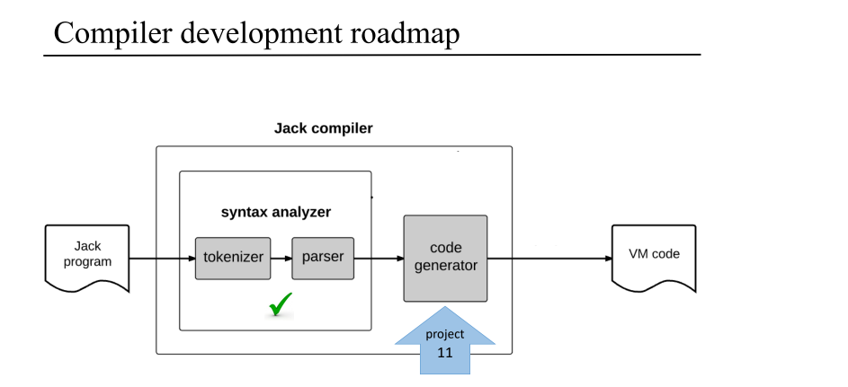
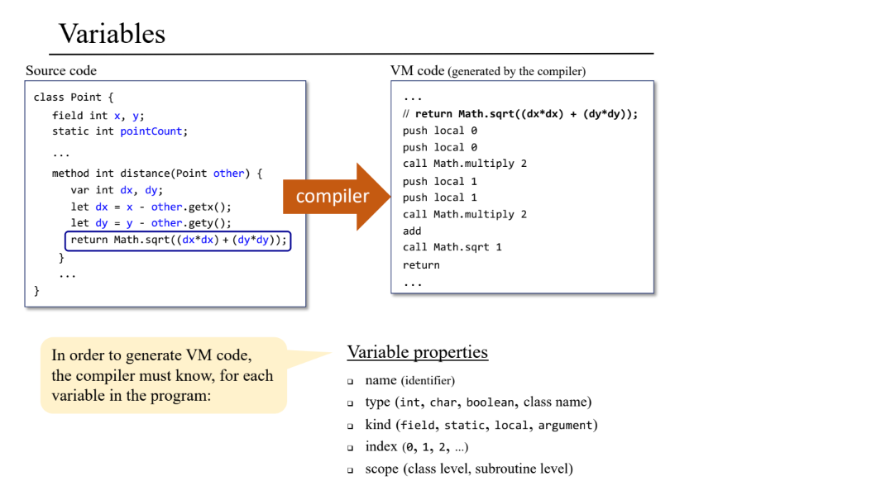
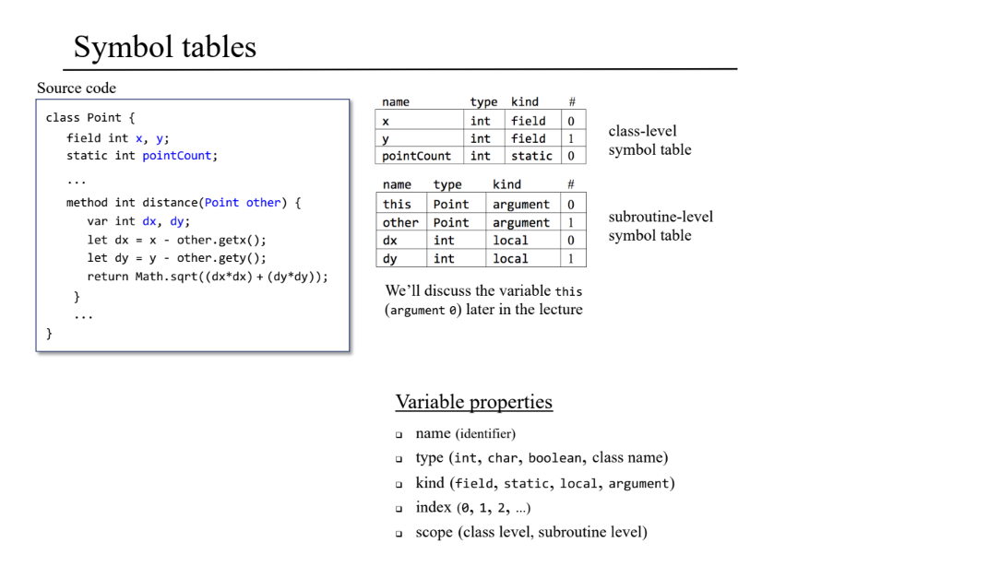
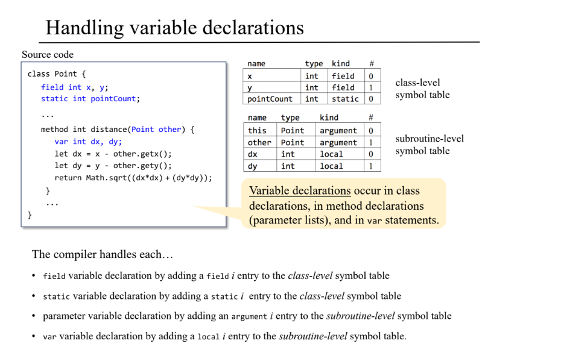
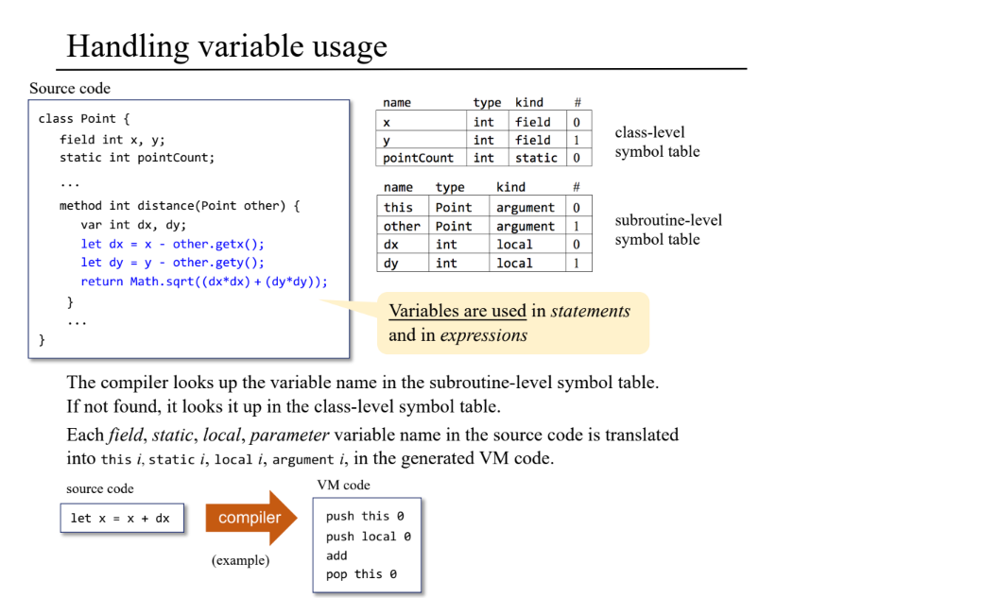
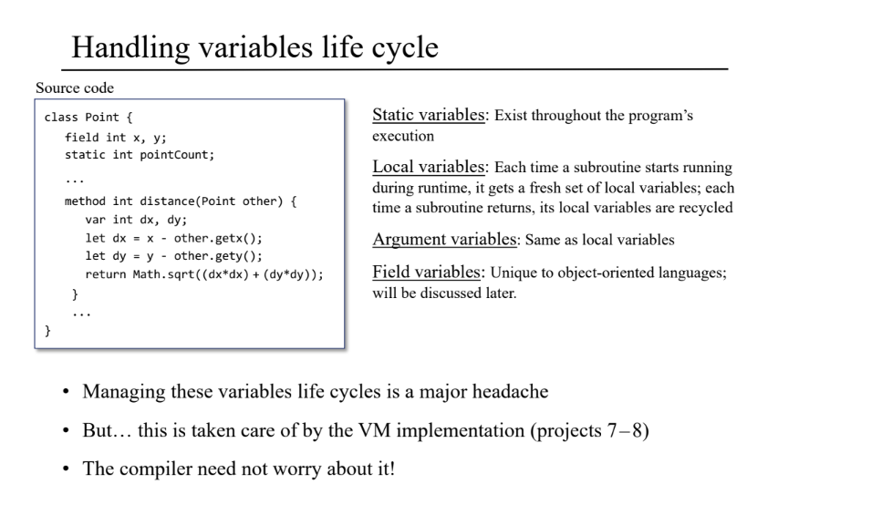

# project 11 Code Generation

## Variables

### Symbol Table

## Testing

###  Seven

这个测试用于检查编译器处理简单的程序，包括整数的数学计算，一个 do 语句，还有一个 return 语句。

### Conversion to binary

测试编译器处理 jack 语言的过程调用元素，比如表达式，函数和所有的语句类型（if、let、while 等）。

### Square Dance

测试编译器处理面向对象的构建元素，例如 constructors, methods, fields and expressions that include method calls.

